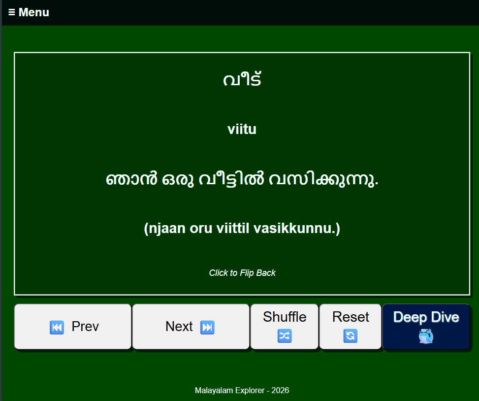

# Malayalam Explorer

A lightweight, interactive web app for learning **Malayalam** — the language of Kerala — through flashcards, cultural context, and geography exploration.

Designed for the **Malayali diaspora**, language learners, travelers to Kerala, and anyone interested in one of India's most beautiful and ancient languages.

## ✨ Features

- 🗺️ Interactive Kerala map with featured locations
- 🕒 Real-time world clock (your local time + IST)
- 📚 **Malayalam flashcards** — 100+ common words + example phrases
- 🏝️ Location hub with cultural & travel highlights
- 📊 Card counter to track progress per session
- 🌴 Clean, mobile-responsive design inspired by Kerala’s greenery and backwaters

## Current Status

- **Frontend**: Pure HTML + basic CSS (no frameworks yet)
- **Future plans**: Migrate to **Vue.js** for better interactivity and state management
- **Deployment**: Live on [GitHub Pages](https://wslider.github.io/malayalam-explorer-website/)

## Live Demo

🌐 **[Try Malayalam Explorer →](https://wslider.github.io/malayalam-explorer-website/)**

## Screenshots

## Project Pages Overview

| Page              | Description                                                                 |
|-------------------|-----------------------------------------------------------------------------|
| **Home**          | Kerala map, live IST clock + user local time, navigation to flashcards & locations |
| **Flashcards**    | Interactive cards for everyday Malayalam words + example sentences          |
| **Locations**     | Overview of Kerala districts & links to featured place pages                |

## Tech Stack (Current)

- HTML5
- Basic CSS (custom, no Tailwind/Bootstrap yet)
- Vanilla JavaScript
- GitHub Pages (static hosting)
- Progress saving (localStorage)

**Coming soon:**
- Vue.js for reactive components
- Audio pronunciation (Web Speech API or recordings)
- Dark mode toggle
- Progress saving (localStorage) - badges and achievments 
